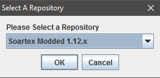
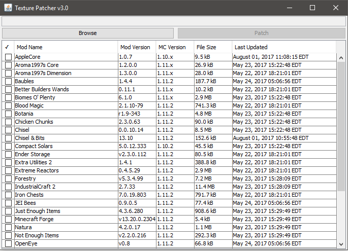
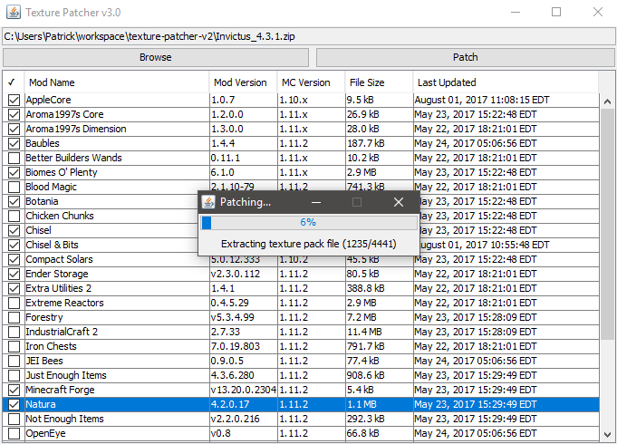

## Texture Pack Patcher v2

This version of the patcher was made to allow for direct integration with the modded github repositories.
Files are pulled directly from github, allowing for modded packs to be updated as soon as updates are pushed.
Right now this was just a weekend project to see if the idea was plausible, it seems like it can work.
A lot of polish still needs to be done to allow for an end user to use this patcher.

## Key Features

* Pull directly from github (uses JGIT under the hood)
* Allows for fetching of new textures without redownloading repository
* Based on the *mod.json* system
* Can mix and match repositories (as long as directories have mod.json files)

## TODOs

* Add checking of already installed mod patches
* Add checking if mod patches installed are outdated
* Add better processing bars to repo clones and pulling

## Screenshot

